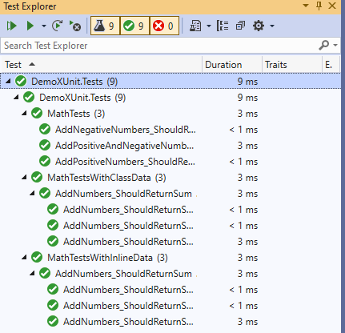

# An xUnit.net Example

## Overview

Automated Unit Tests serve a number of important purposes:

1. They help define requirements for a code component
1. They validate that the code is behaving as expected
1. They provide a "safety net" to verify that a component continues to work after each change
1. They are repeatable, so reduce the risk of potential errors caused by manual input

There are many frameworks to assist in the creation of automated Unit Tests for .NET code.

One of these is [xUnit.net](https://xunit.net/) (sometimes referred to as simply "xUnit"). We will explore some of the features of XUnit.net and show some sample code to illustrate those features.

This solution contains a component with some simple math functions, along with tests to validate the code in those functions.

## The Code to Test

The DemoXUnit project contains the MathFunctions class, which contains 4 functions to perform addition, subtraction, multiplication, and division on a pair of numbers. This demo will focus on testing the _Add_ method, shown below:

```C#
public int Add(int x, int y)
{
    return x + y;
}
```

## Test Project

Creating an XUnit project is simple. Right-click a solution and select Add | New project from the context menu; then, search for and select "xUnit Test Project" from the dialog, as shown in Fig. 1.


Fig. 1

This sample contains a test project named "DemoXUnit.Tests".

You can then add as many test classes as you need to the test project. There is nothing special about a test class itself, but the test methods require attributes, so that xUnit will recognize them and run them properly.

Every test class in the DemoXUnit.Tests contains a private variable of type _MathFunctions_ and a constructor that instantiates that variable. For more complex applications, you may choose to use Interfaces and Dependency injection to instantiate objects like this. I chose this code for simplicity.

```C#
private readonly MathFunctions _math;
public MathTests()
{
    this._math = new MathFunctions();
}
```

## Facts

The simplest xUnit.net tests are methods decorated with the [Fact] attribute. This identifies the method as a test, so that your test runner will automatically run it.

A common pattern in writing automated tests is Arrange/Act/Assert, which identifies three steps.

### Arrange

Setup that must be done before a test is run. This may include initializing variables or getting data in place.

### Act

Call the method that you plan to test.

### Assert

Validate that the method does what it was intended to do.

Below is an example of a method in _MathTestsData.cs_ that tests _MathFunctions.Add_.

```C#
[Fact]
public void AddPositiveNumbers_ShouldReturnSum()
{
    // Arrange
    int firstNumber = 1;
    int secondNumber = 3;

    // Act
    int sum = _math.Add(firstNumber, secondNumber);

    // Assert
    Assert.Equal(4, sum);
}
```

Notice that we have hard-coded the parameters we passed to the _Add_ method and that they are initialize in the "Arrange" section. For a simple test like this, it makes sense to do so. But what if we write other tests that vary only in the data we pass and the expected outcome. _MathTestsData.cs_ contains two other tests shown below:

```C#
[Fact]
public void AddNegativeNumbers_ShouldReturnSum()
{
    // Arrange
    int firstNumber = -1;
    int secondNumber = -3;

    // Act
    int sum = _math.Add(firstNumber, secondNumber);

    // Assert
    Assert.Equal(-4, sum);
}

[Fact]
public void AddPositiveAndNegativeNumbers_ShouldReturnSum()
{
    // Arrange
    int firstNumber = -1;
    int secondNumber = 3;

    // Act
    int sum = _math.Add(firstNumber, secondNumber);

    // Assert
    Assert.Equal(2, sum);
}
```

The three tests are almost identical, except for the input and out data to the _Add_ function. xUnit.net provides a way to simplify and consolidate these tests, as shown in the next section.

## Theories

xUnit.net provides the [Theory] attribute, which you can use in place of the [Fact] attribute. the [Theory] attribute tells xUnit.net that we will be passing data into the test method. We can pass data into the test method in one of two ways: via InlineData or via ClassData.

## InlineData

You can use the [InlineData] to pass data into a test method when you have a series of static values. This attribute is used in combination with the [Theory] attribute. InlineData accepts an array of parameters as arguments. These parameter values are passed to the test method, so that must match the test method's arguments in number, order, and type. The real power of [InlineData] is that you can run the same test multiple times with different inputs and outputs, as shown below.

```C#
[Theory]
[InlineData(1, 3, 4)]
[InlineData(-1, -3, -4)]
[InlineData(-1, 3, 2)]
public void AddNumbers_ShouldReturnSum(int firstNumber, int secondNumber, int expectedResult)
{
    // Arrange

    // Act
    int sum = _math.Add(firstNumber, secondNumber);

    // Assert
    Assert.Equal(expectedResult, sum);
}
```

The test method above will run 3 times, using a different set of values each time. I deliberately left the "Arrange" comment in to emphasize that we no longer need to initialize these variables. This single test replaces the 2 tests in _MathTestsWithInlineData.cs_ replaces the three  tests in _MathTests.cs_.

## ClassData

The [ClassData] attribute is similar to the [InlineData] attribute in that it works with the [Theory] attribute and it allows you to pass data into a test method. The difference is that the [ClassData] attribute points to a separate class where data is stored. This is useful if one or more of the arguments you want to pass in is a complex object, rather than a native type such as an int or a string.

The object passed to [ClassData] must inherit from `IEnumerable<object[]>` - a essentially a collection of arrays. The object array holds the parameters passed into the test method (analogous to the arguments in [InlineData]). Each element in the IEnumerable represents a new test run (analogous to multiple [InlineData] attributes)

Here is the data in _MathTestsData.cs_. It contains three test cases, each consisting of 3 parameters.

```C#
public class MathTestsData : IEnumerable<object[]>
{
    private readonly List<object[]> data = new List<object[]>()
    {
        new object[]
        {
            1,
            3,
            4
        },
        new object[]
        {
            -1,
            -3,
            -4
        },
        new object[]
        {
            -1,
            3,
            2
        }
    };

    public IEnumerator<object[]> GetEnumerator()
    {
        return this.data.GetEnumerator();
    }

    IEnumerator IEnumerable.GetEnumerator()
    {
        return this.GetEnumerator();
    }
}
```

We use this data in our test method by decorating the method with the [ClassData] attribute, as shown below:

```C#
[Theory]
[ClassData(typeof(MathTestsData))]
public void AddNumbers_ShouldReturnSum(int firstNumber, int secondNumber, int expectedResult)
{
    // Arrange

    // Act
    int sum = _math.Add(firstNumber, secondNumber);

    // Assert
    Assert.Equal(expectedResult, sum);
}
```

The test above will run 3 times because there are 3 elements in the IEnumerable of the data in _MathTestsData.cs_. Each run will pass in three arguments to the method: firstNumber, secondNumber, and expectedResult. The results are identical to those when running tests in the other two classes.

## Running Tests

There are several test runners on the market, but I prefer the one included in Visual Studio because I do not need to leave my IDE to run my tests. A simple way to run tests in Visual Studio 2019 is by using the Test Explorer (Fig. 2).


Fig. 2

To launch the Test Explorer, select Test | Test Explorer from the menu.

The buttons at the top allow you to run or debug all the tests or a subset of them. After each test run, an icon next to each test and test class indicates the success or failure of each test(s).

## Conclusion

The Open Source framework xUnit.net allows you to quickly create automated unit tests. And the [Theory] attribute allows flexibility to pass parameters to those tests.

I deliberately created a simple function for clarity, but the testing principles and techniques I describe are applicable to much more complex methods.

In this article, you learned about xUnit.net and how to use some of its features to create meaningful and efficient unit tests.
